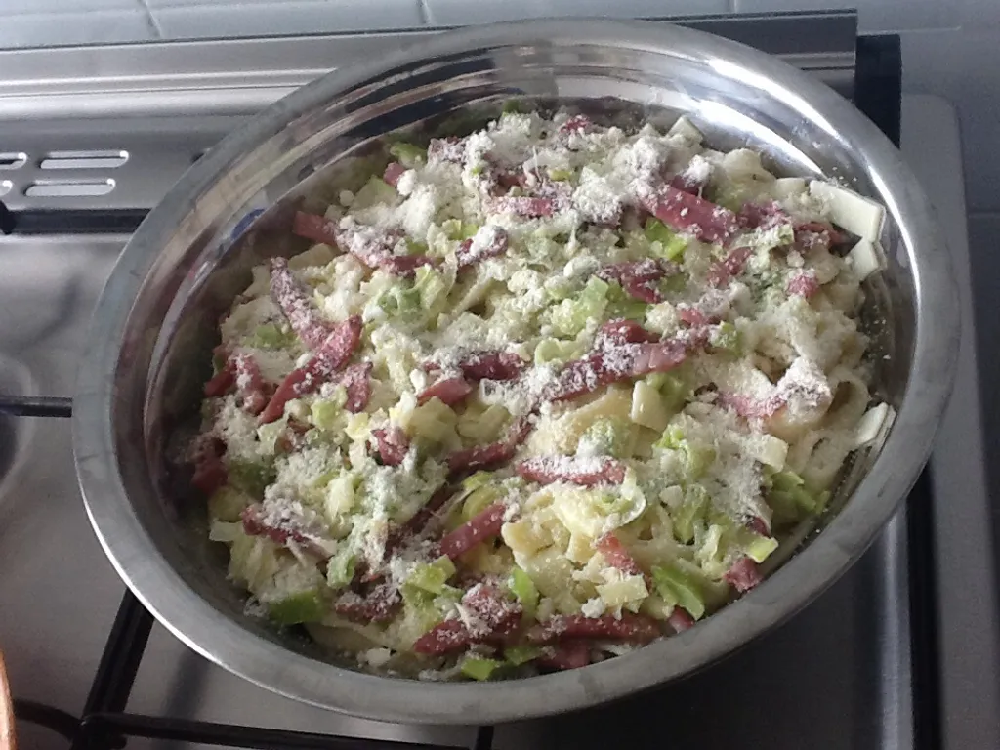

# Cooking

Listes de recettes et ingrédients:

* [Risotto au potiron](#risotto-au-potiron)
* [Tagliatelle à la crème de poireaux](#tagliatelle-a-la-creme-de-poireaux)
* [Gratin d'automne végétalien](#gratin-dautomne-vegetalien)
*
*
*
*
*
*
*
*

# Risotto au potiron {#risotto-au-potiron}

[Lien internet](https://www.marmiton.org/recettes/recette_risotto-au-potiron_12764.aspx)

## Notes

Mettre le riz sans le potimarron (sinon ne cuit pas :3)  

## A tester

1. Mettre le riz sans le potimarron (sinon ne cuit pas :3)  
2. Ajouter petit pois
3. Ajouter tofu
4.

## Ingrédients

* riz 350  g
* bouillon 1⁄2  
* 1  verre de lait
* parmesan rapé
* 1  cuillère de persil haché
* 500  g de potiron
* 1 oignon blanc
* 40g de beurre

## Recette

### ÉTAPE 1
Pelez le potiron, éliminez les graines et coupez-le en tranches fines.

### ÉTAPE 2
Hachez menu l'oignon et faites-le revenir dans 20 g de beurre, ajoutez le poiton, salez et laissez cuire à feu lent, en mélangeant et en versant un peu de bouillon.

### ÉTAPE 3
Quand le potiron est défait, versez le riz et faites-le cuire pendant 18 minutes en rajoutant du bouillon chaud au fur et à mesure qu'il est absorbé.

### ÉTAPE 4
Ajoutez le lait, mélangez à feu vif, ajouter le poivre, le persil et une bonne dose de parmesan. Mélangez rapidement avant de servir de façon que tous les ingrédients soient parfaitement amalgamés.

# Tagliatelle à la crème de poireaux {#tagliatelle-a-la-creme-de-poireaux}

[Lien internet](https://www.marmiton.org/recettes/recette_tagliatelles-a-la-creme-de-poireaux_20838.aspx)

## Ingrédients

* 500 g de tagliatelles
* 2 poireaux
* poivre
* sel
* parmesan
* 150 g de lardons
* 1 petit pot de crème fraîche
* beurre

## Recette

### ÉTAPE 1
Laver puis couper les poireaux en fines rondelles,

### ÉTAPE 2
les mettre à fondre environ 15 min dans une poêle avec un bon morceau de beurre (remuer souvent).

### ÉTAPE 3
Mettre les tagliatelles à cuire comme indiqué sur le paquet.

### ÉTAPE 4
Attendre que les poireaux soient bien fondus et ajouter les lardons, faire dorer.

### ÉTAPE 5
Hors du feu, mettre la crème fraîche et remuer, poivrer et saler à votre goût.

### ÉTAPE 6
Egouter les tagliatelles, les mettre dans un plat et verser la sauce aux poireaux dessus.

### ÉTAPE 7
Ajouter du parmesan râpé.

### ÉTAPE 8
Servir aussitôt.

# Gratin d'automne végétalien {#gratin-dautomne-vegetalien}

[Lien internet](https://www.marmiton.org/recettes/recette_gratin-d-automne-vegetalien_336427.aspx)
